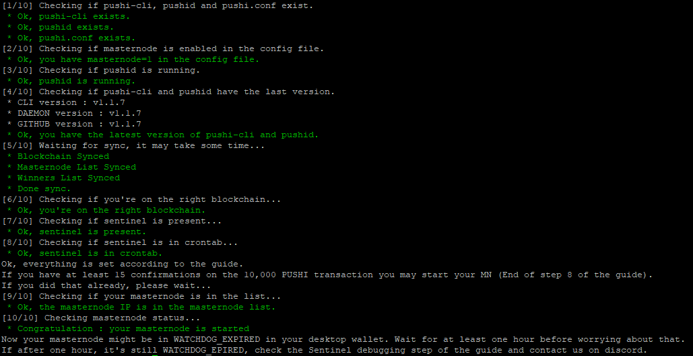

# pushi_utils

If you have problems with a PUSHI masternode, use :

wget -qO - https://raw.githubusercontent.com/BubuLeMag/pushi_utils/master/check_pushi_mn.sh | bash

Or (might be easier if you have to run the script multiple times) :

wget https://raw.githubusercontent.com/BubuLeMag/pushi_utils/master/check_pushi_mn.sh \
chmod 755 check_pushi_mn.sh\
./check_pushi_mn.sh

It will guide you to the most common problems.

If you still have problems, don't hesitate to go to Discord : https://discord.gg/9cVmya9
Copy-paste the result of the script, so we know what work.

This is what you get if everythink works :

If it helps you, here is my PUSHI address PNUavDy9Zwoxx1ithtWrit6KhjF4WEzjjn
:)
